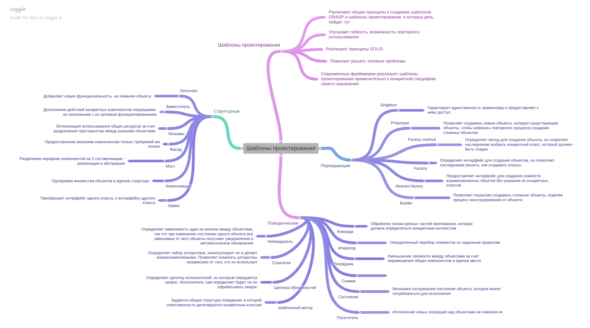

# Памятка о шаблонах проектирования

****
[К описанию проекта](../../../README.md)
****
Общее представление шаблонов проектирования
****

***
## Введение 
Традиционно под шаблонами проектирования понимают 2 основных концепта:
* [Grasp](https://github.com/engine-it-in/different-level-task/blob/main/second%20level/grasp/README.md)
  * Концептуальные шаблоны проектирования и принципы, которые можно считать установками к созданию переиспользуемого, развивающегося кода;
* [Gof](https://github.com/engine-it-in/different-level-task/blob/main/second%20level/gof/README.md)
  * Основные шаблоны проектирования, описанные группой разработчиков, цель которых состоит в создании конкретных решений;

## Gof
* Gof содержат популярные шаблоны проектирования программного обеспечения;
* Концепция шаблонов проектирования была первоначально описана в книге «Design Patterns: Elements of Reusable Object-Oriented Software». 
* В книгу вошли 23 паттерна, решающие различные проблемы объектно-ориентированного дизайна.
  * Помогают решать популярные, повторяющиеся задачи;
  * Улучшают гибкость и повторное использование кода;

## Применимость
* Когда говорят о шаблонах проектировния, то имеет в виду преимущественно Gof шаблоны; 
* Они сконцентрированы на решении конкретных практических задач постоянно возникающих в практике разработки программного обеспечения;
* Шаблоны проектирования основаны на реализации SOLID принципов, как основы разработки надежных и переиспользуемых систем;

## SOLID
* Что такое шаблоны проектирования - разные подходы к решению типовых задач программирования, которые направлены на то, чтобы создаваемый код соответсвовал принципам SOLID:
    * SOLID - 5 принципов, которые описывают, каким должен быть создаваемый код:
        * (S) Каждый компонент кода должен решать одну конкретную задачу;
        * (O) Каждый компонент должен быть открыт для модификаций и закрыт для изменений;
        * (L) Если для создания компонентов используется иерархия классов, то основной, базовый класс может быть заменен на любой дочерний класс без потери функциональности;
        * (I) При использовании интерфейсов лучше создавать интерфейсы отвечающий за конкретные действия, чем интерфейсы, которые будут агрегировать в себе множество различных ответсвенностей;
        * (D) Создаваемые компоненты должны зависеть от минимального количество других компонентовж
    * Какие бывают - Конкретные, о которых мы будем говорить в этом курсе (GOF) и более выкокоуровневые (GRASP), которые являются основными принципами программирования;
    * Для чего созданы - Решать повторяющиеся проблемы наиболее успешным образом;
    * Актуальность - шаблоны проектирования сверх актуальный аспект программирования. Многие современные фреймворки построены на шаблонах проектирования и реализуют наиболее востребованные из них;
