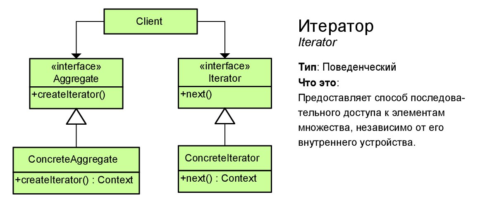

# Итератор (Iterator)
****
* [К описанию поведенческих шаблонов](../README.md)
****

## Тип
* Поведенческий шаблон;

## Назначение
* Поверхностный обход элементов определенной структуры;

## Суть
* Существуют разные структуры данных, используемые в программах
* Изменение/дополнение программы новой структурой данных приводит 
к необходимости адаптировать текущий код под возможность 
обработки новой структуры;

## Контекст применения
* Необходимо скрыть от клиента/обработчика детали реализации 
структуры и предоставить ему набор методов, которые 
позволят выполнить перебор требуемых данных;

## Какой функционал предоставляет
* Простые методы перебора элементов;
* Единый интерфейс работы с объектами;

## Преимущества и недостатки при использовании
| Преимущества                                              | Недостатки                                               |
|-----------------------------------------------------------|----------------------------------------------------------|
| Единый способ работы с пользовательской структурой данных | Там где можно использовать цикл, нужно использовать цикл |

## Изображение

# Формулировка задачи
* Необходимо разработать программу, которая будет перебирать набор документов.
Перебор элементов должен строиться не на основе цикла, а на программных компонентах, 
в которых можно будет гибко настраивать логику перебора документов по любому добавляемому атрибуту;

#### [Алгоритм реализации](Algo.md)