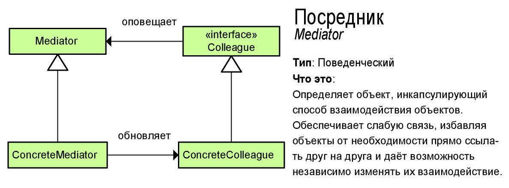

# Посредник (Mediator)
****
* [К описанию поведенческих шаблонов](../README.md)
****

## Тип
* Поведенческий шаблон;

## Назначение
* Уменьшить общую связность между классами за счет перемещения всех связей в единое место;
* Назначение этого шаблона - переложить связи между множеством системных компонентов в один класс;

## Суть
* Действия, выполняемые в классах, перемещаются в общие интерфейсы или классы/класса;
* Например, используя шаблон, команда, которые перемещаются в единый класс;

## Контекст применения
* Запутанная последовательность действий объектов, 
которые по ходу своего функционирования должны взаимодействовать друг с другом для достижения общего результата;
* Так, посредник становится дирижером системы;

## Применимость
* В системах с сложной, распределенной логикой работы;
* Перегруженные ответственностью классы, которые нуждаются в рефакторинге;
* Когда для реализации нового класса требуется создать иерархию новых системных компонентов;

## Какой функционал предоставляет
* Единая точка управления логикой системы;

## Преимущества и недостатки при использовании
| Преимущества                                    | Недостатки                                                                                       |
|-------------------------------------------------|--------------------------------------------------------------------------------------------------|
| Устранение множества зависимостей               | Команда, потенциально, может стать комом функциональности и сделать систему еще более запутанной |
| Более простое взаимодействие между компонентами |                                                                                                  |

## Изображение

# Формулировка задачи
* Представим, что у нас есть отдельная информационная аудиосистема 
для отправки документов. В системе должны иметь возможность работать пользователи
с разными правами - Администраторы и обычные операторы. Все пользователи 
отправляют документы в систему и получают документы. У пользователей 
должен быть признак доступности в системе, но функционально этот признак 
нужен только администратору, потому что по этому признаку устанавливается, 
есть ли он в системе или нет. Если его нет, то не должно быть возможности кого-то добавить в систему;

#### [Алгоритм реализации](Algo.md)