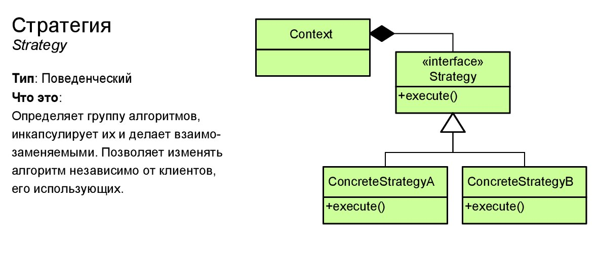

# Стратегия (Strategy)
****
* [К описанию поведенческих шаблонов](../README.md)
****

## Тип
* Поведенческий шаблон;

## Назначение
* Определение семейства подобных алгоритмов, которые должны быть заменяемы во время исполнение программы;

## Суть
* Во время исполнения программы может потребоваться изменить рабочий алгоритм, в зависимости от выбранного объекта действий;
* Шаблон предлагает поведение, которое помогает заменять схожие алгоритмы по контексту исполнения программы;

## Контекст применения
* Для ситуации, когда во время исполнения программы, в зависимости от внешних условий необходимо выбрать конкретный алгоритм исполнения логики программы;

## Применимость
* Когда есть необходимость использовать разные варианты, внутри одного конкретного объекта;
* В ситуации, когда есть похожие классы, которые различаются небольшими, некритичными деталями;
* Когда развесистый оператор превращается в оркестратор - каждая ветка оператора реализует свое поведение;

## Какой функционал предоставляет
* Определение общего алгоритма поведения с возможностью переопределить отдельные шаги;

## Преимущества и недостатки при использовании
| Преимущества        | Недостатки                     |
|---------------------|--------------------------------|
| Замена алгоритмов   | Усложнение, нагромождение кода |
| Изоляция алгоритмов |                                |

## Алгоритм реализации
* Выделить наиболее изменяющийся алгоритм;
* Выделить общий интерфейс алгоритма;
* Для каждой отдельной вариации алгоритма - свой класс;
* Контекст должен содержать ссылку на объект стратегию и меть возможность ее изменять через интерфейс;

## Изображение

# Формулировка задачи
* Необходимо для переданного списка документов реализовать 2 алгоритма поиска документов.
* Первый алгоритм должен искать документ в статусе Sign, 
выбирать документ с максимальным номером и выводить в консоль его номер. Если документ не найден, 
то необходимо вывести исключение, в котором будет обозначено, что документа не существует. 
Пусть это будет алгоритм поиска финансовых документов.
* Второй алгоритм должен искать документ в статусе Draft, 
выбирать документ с минимальным номером и выводить в консоль его номер. Если документ не найден, 
то необходимо вывести исключение, в котором будет обозначено, что документа не существует. 
Пусть это будет алгоритм поиска менеджерских документов.