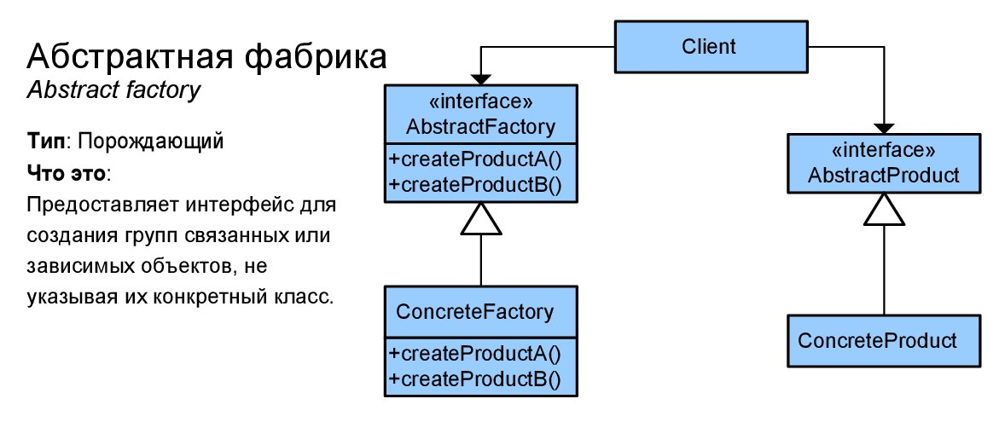

# Абстрактная фабрика (Abstract factory)
****
* [К описанию порождающих шаблонов](../README.md)
****

## Тип
* Порождающий шаблон;

## Назначение
* Создание различных видов фиксированного набора объектов;

## Суть
* Когда по ходу работы программы требуется создавать конкретные объекты, 
но для каждого контекста набора объектов должны различаться;

## Контекст применения
* Оркестрация конкретными типами объектов, требуемыми для 
конкретной ситуации;

## Применимость
* Для бизнес логики, которая должна организовать взаимодействие 
разных видов связанных друг с другом продуктов;
* Когда уже используется [фабричный метод](../factorymethod/README.md), 
но требуется ввести новые типы продуктов;

## Какой функционал предоставляет
* Создание конкретного набора объектов;
* Для каждой ситуации набор объектов может быть уникальным;

## Преимущества и недостатки при использовании
| Преимущества                                      | Недостатки                                              |
|---------------------------------------------------|---------------------------------------------------------|
| Сочетаемость продуктов                            | Усложнение кода программы                               |
| Избавляет код от привязки к конкретным классам    | Требует наличия всех типов продуктов в каждом семействе |
| Выделяет код производства продуктов в одном место |                                                         |
| Упрощение добавления новых продуктов              |                                                         |

## Алгоритм реализации
* Выделить соотношения типов продуктов и вариаций семейств, порождающих продукты;
* Выделить вариации продуктов и типизировать их интерфейсами;
* Определить интерфейс абстрактной фабрики, 
который должен иметь методы для создания каждого типа продукта;
* Создать классы конкретных фабрик, реализующие интерфейс абстрактной фабрики. 
Этих классов должно быть столько же, сколько семейств продуктов;
* Определенная фабрика должна создаваться 
при работе программы и должна быть передана в клиентский код;
* В клиентском коде в конструкторе должны вызываться методы требуемых фабрик;

## Изображение

# Формулировка задачи
* В данной задаче будет идти речь о двух наборах документов. Первый набор документов - 
набор необходимый для получения степени магистра, а второй для получения степени бакалавра.
Каждый набор документов характеризуется. Набор документов выдается студенту. 
Студент характеризуется общим рейтингом, выпускным документом и сделанной научной работой.
Рейтинг - это выбор из общей градации - младший/средний/квалифицированный специалист. 
Диплом содержит данные о номере, средней оценке и списке предметов, 
получаемых в магистратуре или бакалавриате. Научная работа характеризуется номером, названием,
 темой и типом наук. В программе должно распечататься рейтинг, диплом и 
научная работа конкретной образовательной программы;
