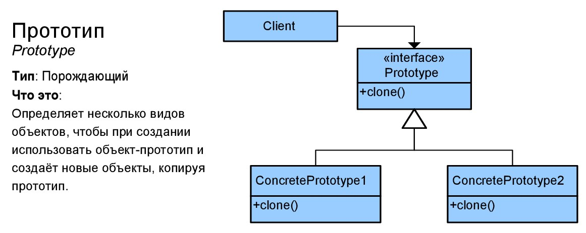

# Прототип (Prototype)
****
* [К описанию поведенческих шаблонов](../README.md)
****

## Тип
* Порождающий шаблон;

## Назначение
* Дает возможность простого копирования объектов, 
без погружения в их реализацию;

## Суть
* Делегирует копирование самим копируемым объектам;
* Копируемые объекты - прототипы;

## Контекст применения
* В ситуации, когда требуется создавать копии сложных объектов;

## Применимость
* Когда код не должен зависеть от копируемых объектов; 
* Когда есть необходимость создавать конкретные подклассы 
не захламляя код;

## Какой функционал предоставляет
* Использование клонированных объектов, разных конфигураций конкретного объекта;

## Преимущества и недостатки при использовании
| Преимущества                                            | Недостатки                                                    |
|---------------------------------------------------------|---------------------------------------------------------------|
| Клонирование объектов без привязки к конкретным классам | Сложность клонирования объектов, который имеют внешние ссылки |
| Меньше повторяющегося кода                              |                                                               |
| Быстрое создание объектов                               |                                                               |
| Альтернатива подклассам                                 |                                                               |

## Алгоритм реализации
* Создание копирующего интерфейса;
* Добавить в классы создаваемых прототипов конструктор, 
который принимает в качестве аргумента объект 
текущего класса;
* Реализовать хранилище прототипов для хранения вариаций
 объектов;

## Изображение

# Формулировка задачи
* В данной задаче речь будет идти о шаблонном документе, который создается на 
основе имени документа. Этот документ должен поддерживать создание простого 
собственного прототипа, которое должно реализовываться через промежуточный объект, 
ответственный за клонирование шаблонного документа;