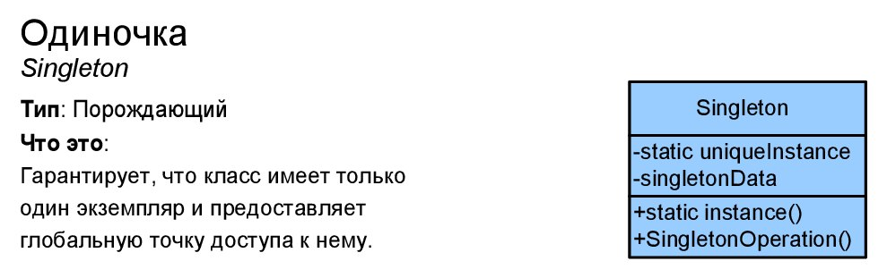

# Одиночка (Singleton)
****
* [К описанию поведенческих шаблонов](../README.md)
****
## Тип
* Порождающий шаблон;

## Назначение
* Создание единого экземпляра класса и предоставление доступа к нему;

## Суть
* Гарантирует, что у класса будет только один экземпляр;
* Предоставляет доступ к единому экземпляру;

## Контекст применения
* В ситуации, когда требуется, чтобы у класса был единый экземпляр, 
который будет хранить свой контекст;

## Применимость
* Когда в логике программы должен быть единственный экземпляр какого-то конкретного класса; 

## Какой функционал предоставляет
* Гарантия наличия в программе единственного экземпляра класса;

## Преимущества и недостатки при использовании
| Преимущества                                        | Недостатки                                      |
|-----------------------------------------------------|-------------------------------------------------|
| Гарантирует наличие единственного экземпляра класса | Нарушает принцип единственной ответсвенности    |
| Предоставляет доступ к созданному объекту           | Создает проблемы мультипоточности               |
| Реализует ленивую инициализацию                     | Требует создания Mock объектов при тестировании |

## Изображение

# Формулировка задачи
* Реализовать шаблон синглтон и проверить его работу через вызов разных документов. 
В итоге программа должна возвращать один и тот же экземпляр документа;