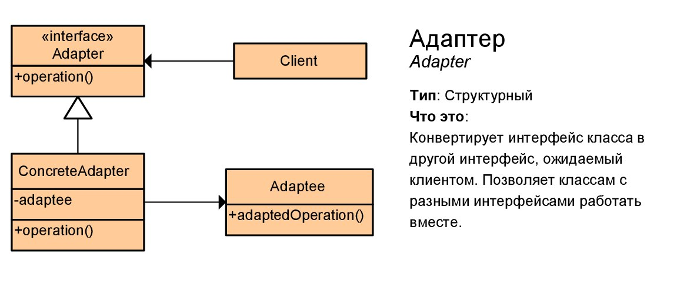

# Адаптер (Adapter)

****
* [К описанию структурных шаблонов](../README.md)
****

## Тип
* Структурный шаблон;

## Назначение
* Преобразование одного интерфейса, в другой интерфейс;
* Необходим для совместной работы классов, интерфейсы которых не совместимы;

## Суть
* Представления существующего класса программы к новому виду;
* Реализует представление объекта к новому виду так, что сам
  взамодействующий объект ничего не знает о первоначальном объекте;

## Контекст применения
* Когда для существующего объекта требуется новый тип 
представления существующей функциональности и сигнатуры;

## Применимость
* Для несопостовимых классов, когда есть необходимость организовать их взаимодействие;

## Какой функционал предоставляет
* Когда есть необходимость использовать класс, но нет возможности из-за
  несоответствия интерфейсов классов;
* Когда вам нужно использовать несколько существующих подклассов, но в них
  не хватает какой-то общей функциональности,
  причём расширить суперкласс вы не можете;

## Преимущества и недостатки при использовании

| Преимущества                                                           | Недостатки                |
|------------------------------------------------------------------------|---------------------------|
| Отделение и скрытие от клиента подробностей преобразования интерфейсов | Усложнение кода программы |

## Алгоритм реализации
* Выделить несовместимые классы;
* Создать интерфейс, который классы смогут взаимодействовать друг с другом;
* Создать адаптер и реализовать интерфейс;
* Создать в адаптере поле, которое будет хранить ссылку на объект сервиса;
* Реализовать все методы интерфейса в адаптере;

## Изображение

# Формулировка задачи
* Необходимо реализовать временное хранилище документов.
Оно представляет альтернативу не реализованной 
базы документов. Хранилище - структуру, 
в которой документ помещается по своему номеру. 
Хранилище документов должно поддерживать методы - 
save (сохранение в хранилище документа),
load (загрузка документа из хранилища), 
delete (удаление документа из хранилища). 
Хранилище - временная альтернатива не существующей базе документов, 
поэтому, в логике основной программы требуется использовать команды CRUD, 
для реализации взаимодействия с планируемой базой документов, 
чтобы при смене хранилища на базу не потребовалось в этой части 
изменять основной код программы. Напомним, CRUD операции
С - создание/вставка объекта, команда insert. Для хранилища аналог - save.  
R - чтение объекта, команда select. Для хранилища аналог - load. 
U - обновление объекта, команда update. 
D - удаление объекта, команда remove. Для хранилища аналог - delete.
По команде update в документе статус должен быть изменен на Sign;